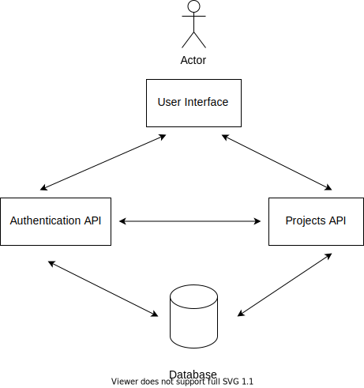

# DESIGN DOCUMENT for Suza Project Showcase

# Introduction

A lot of projects are at done at SUZA. Projects for courses, and final year projects. A lot of these ideas end up sitting in the students' computers. And those that don't are not seen anymore once the students graduate. Come the time for submitting project titles, student's titles get rejected as they are told that the particular idea they are thinking has already been done. Now, what if students early on knows the projects that have already been done? It might lead them to newer thinking grounds and will be inspired by what their peers are doing. 

With that comes the motivation behind the *SUZA Project Showcase*. A platform where students can submit their projects to be curated by the university staff and be displayed for all to see, which will empower students, and lead to big ideas.

# Relational

# Objectives

## General Objectives

Build a platform where students can showcase their projects.

## Challenge of current existing system

Currently students after finishing their projects only a few people will know about the project. When final year students are picking an idea for a project, the student's idea might get rejected.

## Solution to current business operations

Provide a platform where students can showcase their projects. Which can help students who are thinking ideas for their projects to not run into a problem of their being rejected because the particular idea has already been implemented.

# Deliverables

# Functional Requirements

- The system must allow user to register using their email.
  
- The system must allow user to log into their account by entering their email and password.
  
- The system must allow users to reset their password by clicking on "I forgot my password" and receiving a link to their email address.
  
- The system must allow users to submit details of their project.

- The system must allow users to view projects.

- The system must allow admin to manage submitted projects.

# Security Requirements

## Authentication

The system shall support authentication.

## Authorization

The user accounts shall possess privileges to perform signing activities. However, the privileges must be limited.

## Availability

The system shall do mirroring to allow data to be available in separate sites.

## Integrity

The system shall ensure all data provided by application has consistency.

## Auditing

The system shall keep historical records (logging) of events and processes executed in or by an application.

# Development methodologies

The project will use waterfall methodology.

## Advantages & Disadvantages

### Advantages
- Project requirements are agreed early on, so planning is simple and clear.
- It is easy to give accurate estimates for resources and deadlines.
- It's easy to measure progress.
- There are no changes to requirements once project starts.

### Disadvantages
- It can be difficult for client to express needs at the beginning of the project.
- If the client is not satisfied with the product in verification, it is costly to go back and code.
- It is not flexible.

## Why decided to use this method

- The time required to complete the project is known (20 days).
- Limiting the scope in advance to prevent scope creep.

# Architecture of the system

The system will use client-server architecture. It will also use microservice architecture.

# Conceptual design of the system

# User Interface

<!-- Create mockups if there is time -->

The website will have 5 pages.
1. The home page, where projects are displayed.
2. The page for adding a new project.
3. The admin dashboard
4. Registering page
5. Login page

# Database Design

# Activity flow of the system

# Use case to every functional and class diagram requirement

# Development technology (languages)

The project will use javascript using the Angular framework for the frontend, and Java using the Spring Boot framework for the backend.