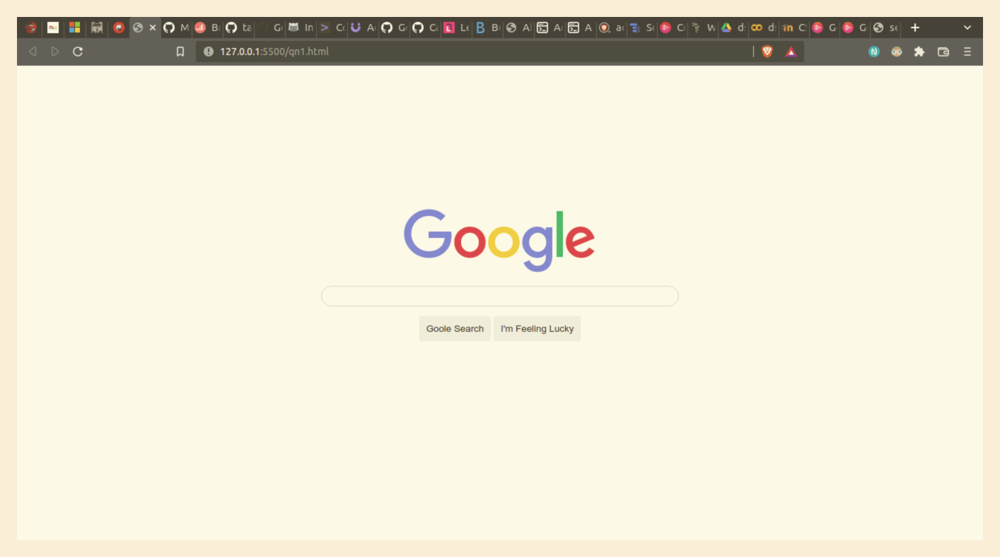
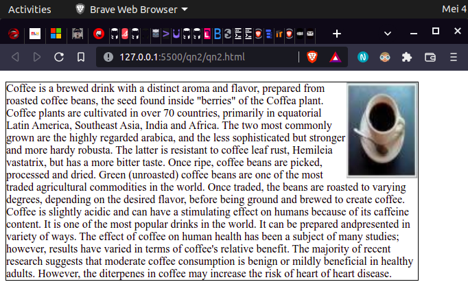
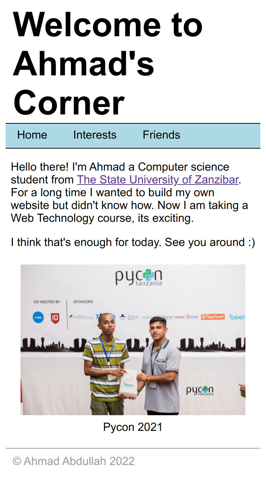
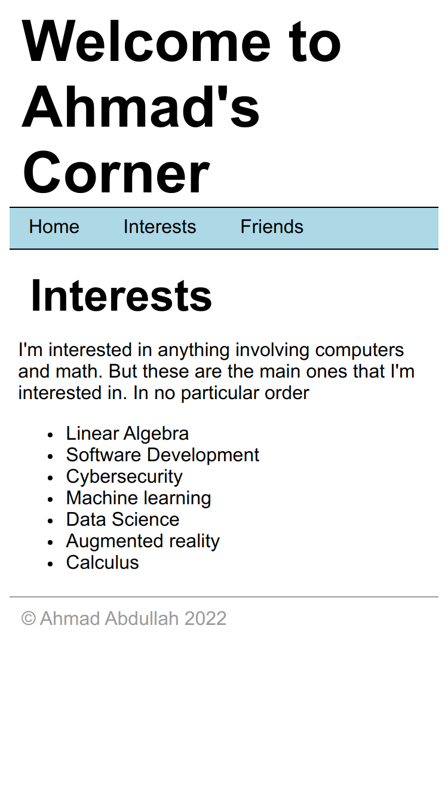
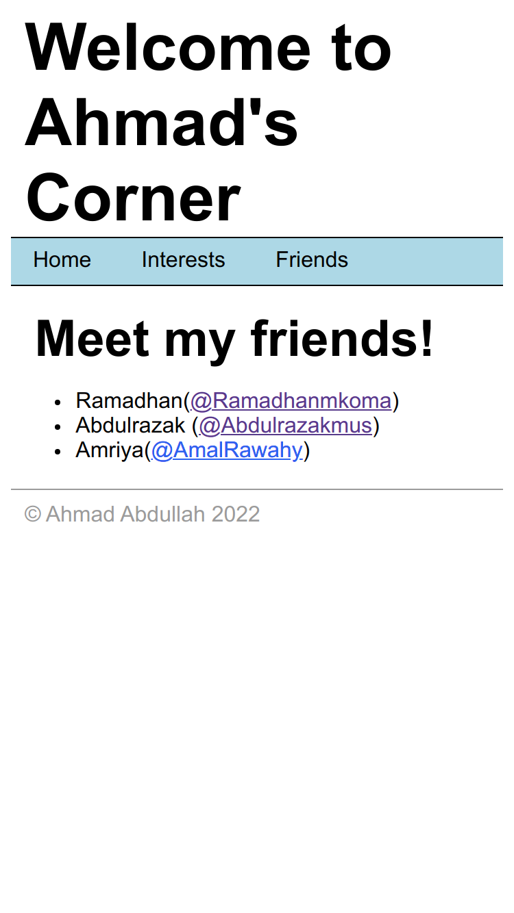
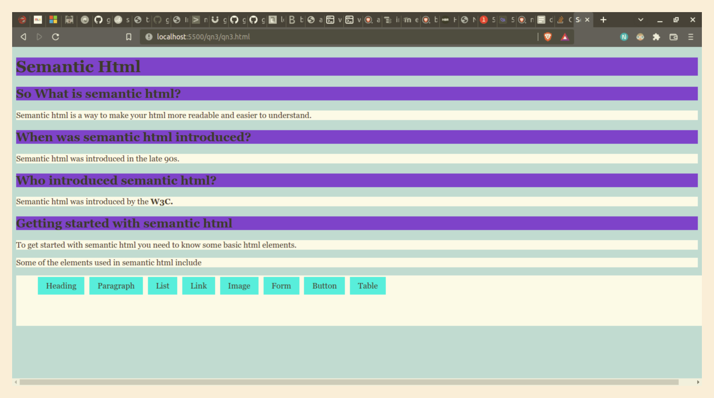

# BCS/15/20/008/TZ

# Practical 2, CSS

# Qn 1.

```html
<!DOCTYPE html>
<html lang="en">
  <head>
    <meta charset="UTF-8" />
    <meta http-equiv="X-UA-Compatible" content="IE=edge" />
    <meta name="viewport" content="width=device-width, initial-scale=1.0" />
    <title>Question 1</title>
    <link rel="stylesheet" href="qn1.css" />
  </head>
  <body>
    <!-- Ahmad Abdullah, Web Technologies-->
    <main>
    <center>
      <div class="container">
        
        <form>
          <p><input type="text" id="box" /></p>
          <input type="button" value="Goole Search" class="btn"/>
          <input type="button" value="I'm Feeling Lucky" class="btn"/>
        </form>
      </div>
    </center>
    </main>
  </body>
</html>

```

```css
/* Qn1 CSS*/

body {
    font-family: Arial, Helvetica, sans-serif;
    font-size: 14px;
}

.container {
    margin-top:15%;
}

#box {
    min-width:500px;
    height: 25px;
    border-radius: 24px;
    border: 1px solid lightgray;
}

.btn {
    background-color: #eee;
    padding: 10px;
    border-style: none;
    border-radius: 3px;
    cursor: pointer;

}
```



# Q2

```html
<!DOCTYPE html>
<html lang="en">
  <head>
    <meta charset="UTF-8" />
    <meta http-equiv="X-UA-Compatible" content="IE=edge" />
    <meta name="viewport" content="width=device-width, initial-scale=1.0" />
    <title>Question 2</title>
    <link rel="stylesheet" href="qn2.css" />
  </head>
  <body>
    <!-- Ahmad Abdullah-->

    <p>
      
      Coffee is a brewed drink with a distinct aroma and flavor, prepared from
      roasted coffee beans, the seed found inside "berries" of the Coffea plant.
      Coffee plants are cultivated in over 70 countries, primarily in equatorial
      Latin America, Southeast Asia, India and Africa. The two most commonly
      grown are the highly regarded arabica, and the less sophisticated but
      stronger and more hardy robusta. The latter is resistant to coffee leaf
      rust, Hemileia vastatrix, but has a more bitter taste. Once ripe, coffee
      beans are picked, processed and dried. Green (unroasted) coffee beans are
      one of the most traded agricultural commodities in the world. Once traded,
      the beans are roasted to varying degrees, depending on the desired flavor,
      before being ground and brewed to create coffee. Coffee is slightly acidic
      and can have a stimulating effect on humans because of its caffeine
      content. It is one of the most popular drinks in the world. It can be
      prepared andpresented in variety of ways. The effect of coffee on human
      health has been a subject of many studies; however, results have varied in
      terms of coffee's relative benefit. The majority of recent research
      suggests that moderate coffee consumption is benign or mildly beneficial
      in healthy adults. However, the diterpenes in coffee may increase the risk
      of heart of heart disease.
    </p>
  </body>
</html>

```

```css
img {
    float:right;
}

p {
    border: 1px solid;
    max-width: 600px;
}
```



# Q2a
## Home
```html
<!DOCTYPE html>
<html lang="en">
  <head>
    <meta charset="UTF-8" />
    <meta http-equiv="X-UA-Compatible" content="IE=edge" />
    <meta name="viewport" content="width=device-width, initial-scale=1.0" />
    <title>Ahmad's Corner</title>
    <link rel="stylesheet" href="qn2a.css" />
  </head>
  <body>
    <header>
      <h1>Welcome to Ahmad's Corner</h1>
      <nav>
        <ul>
          <li><a href="./index.html">Home</a></li>
          <li><a href="./interests.html">Interests</a></li>
          <li><a href="./friends.html">Friends</a></li>
        </ul>
      </nav>
    </header>
    <main>
      <article>
        <p>
          Hello there! I'm Ahmad a Computer science student from
          <a href="https://www.suza.ac.tz" target="_blank"
            >The State University of Zanzibar</a
          >. For a long time I wanted to build my own website but didn't know
          how. Now I am taking a Web Technology course, its exciting.
        </p>
        <p>I think that's enough for today. See you around :)</p>
      </article>
      <aside>
        <table>
          <thead>
            <tr>
              <th>
                
              </th>
            </tr>
          </thead>
          <tbody>
            <tr>
              <td>Pycon 2021</td>
            </tr>
          </tbody>
        </table>
      </aside>
    </main>
    <footer>
      <p>&copy; Ahmad Abdullah 2022</p>
    </footer>
  </body>
</html>

```

## Interests

```html
<!DOCTYPE html>
<html lang="en">
  <head>
    <meta charset="UTF-8" />
    <meta http-equiv="X-UA-Compatible" content="IE=edge" />
    <meta name="viewport" content="width=device-width, initial-scale=1.0" />
    <title>Ahmad's Corner | Interests</title>
    <link rel="stylesheet" href="qn2a.css">
  </head>
  <body>
    <header>
      <h1>Welcome to Ahmad's Corner</h1>
      <nav>
        <ul>
          <li><a href="./index.html">Home</a></li>
          <li><a href="./interests.html">Interests</a></li>
          <li><a href="./friends.html">Friends</a></li>
        </ul>
      </nav>
    </header>
    <main>
      <article>
        <h2>Interests</h2>
        <p>
          I'm interested in anything involving computers and math. But these are
          the main ones that I'm interested in. In no particular order
        </p>
        <ul>
          <li>Linear Algebra</li>
          <li>Software Development</li>
          <li>Cybersecurity</li>
          <li>Machine learning</li>
          <li>Data Science</li>
          <li>Augmented reality</li>
          <li>Calculus</li>
        </ul>
      </article>
    </main>
    <footer>
      <p>&copy; Ahmad Abdullah 2022</p>
    </footer>
  </body>
</html>

```

# Friends

```html
<!DOCTYPE html>
<html lang="en">
  <head>
    <meta charset="UTF-8" />
    <meta http-equiv="X-UA-Compatible" content="IE=edge" />
    <meta name="viewport" content="width=device-width, initial-scale=1.0" />
    <title>Ahmad's Corner | Friends</title>
    <link rel="stylesheet" href="qn2a.css">
  </head>
  <body>
    <header>
      <h1>Welcome to Ahmad's Corner</h1>
      <nav>
        <ul>
          <li><a href="./index.html">Home</a></li>
          <li><a href="./interests.html">Interests</a></li>
          <li><a href="./friends.html">Friends</a></li>
        </ul>
      </nav>
    </header>
    <main>
      <article>
        <h2>Meet my friends!</h2>
        <ul>
          <li>
            Ramadhan(<a
              href="https://github.com/Ramadhanmkoma"
              target="_blank"
              >@Ramadhanmkoma</a
            >)
          </li>
          <li>
            Abdulrazak (<a
              href="https://github.com/Abdulrazakmus"
              target="_blank"
              >@Abdulrazakmus</a
            >)
          </li>
          <li>
            Amriya(<a
              href="https://github.com/AmalRawahy"
              target="_blank"
              >@AmalRawahy</a
            >)
          </li>
        </ul>
      </article>
    </main>
    <footer>
      <p>&copy; Ahmad Abdullah 2022</p>
    </footer>
  </body>
</html>

```

```css
* {
    font-family: "Helvetica Neue", "Helvetica", arial, sans-serif; 
}

header h1 {
    font-weight: bolder;
    font-size: 3em;
    margin: 0px 10px;
}

header h2 {
    font-weight: lighter;
    margin: 0px 10px 10px;
}

header nav {
    border-top: 1px solid black;
    border-bottom: 1px solid black;
}

header nav ul {
    list-style-type: none;
    margin: 0;
    padding: 0;
    width: 100%;
    background-color: lightblue;
}

header nav ul li {
    display: inline-block;
}

header nav ul li a {
    display: block;
    color: #000;
    padding: 8px 16px;
    text-decoration: none;
}

header nav ul li a:hover {
    background-color: blue;
}

article {
    margin: 5% 2%;
}

article h2 {
    margin: 0px 10px;
    font-size: 2.3em;
}

footer p {
    color: #9b9b9b;
    border-top: 1px solid #9b9b9b;
    padding: 10px;
}

img {
    width: 90%;
}

th, td {
    text-align: center;
}
```




# Q3a

```html
<!DOCTYPE html>
<html lang="en">
  <head>
    <meta charset="UTF-8" />
    <meta http-equiv="X-UA-Compatible" content="IE=edge" />
    <meta name="viewport" content="width=device-width, initial-scale=1.0" />
    <title>Semantic Html</title>
    <link rel="stylesheet" href="qn3.css">
  </head>
  <body>
    <!-- Lets learn semantic html-->
    <h1>Semantic Html</h1>
    <h2>So What is semantic html?</h2>
    <p>
      Semantic html is a way to make your html more readable and easier to
      understand.
    </p>

    <h2>When was semantic html introduced?</h2>
    <p>Semantic html was introduced in the late 90s.</p>

    <h2>Who introduced semantic html?</h2>
    <p>Semantic html was introduced by the <strong>W3C.</strong></p>

    <h2>Getting started with semantic html</h2>
    <p>
      To get started with semantic html you need to know some basic html
      elements.
    </p>
    <p>Some of the elements used in semantic html include</p>
    <ul>
      <li>Heading</li>
      <li>Paragraph</li>
      <li>List</li>
      <li>Link</li>
      <li>Image</li>
      <li>Form</li>
      <li>Button</li>
      <li>Table</li>
    </ul>

  </body>
</html>
```

# Q3b

```css
/** Qn3 CSS **/

* {
    font-family: Georgia, 'Times New Roman', Times, serif;
}

body {
    background-color: lightblue
}

h1, h2 {
    background-color: blue;
}

p {
    background-color: white;
}

ul {
    background-color: white;
    list-style-type: none;height: 100px;
    width: 100%;
}

ul li{
    display: inline-block;
    margin: 3px 3px;
    padding: 8px 16px;
    background-color: aqua;
}


```

