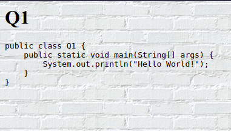

# Q1
```html
<html>
<head>
<title>Q1</title>
</head>
<body background="./assets/whtbrickwallbg.gif">
<!-- Ahmad Abdullah Web Technologies 09 April 2022-->
<h1>Q1</h1>
<code>
<pre>
public class Q1 {
    public static void main(String[] args) {
        System.out.println("Hello World!");
    }
}
</pre>
</code>
</body>
</html>
```

