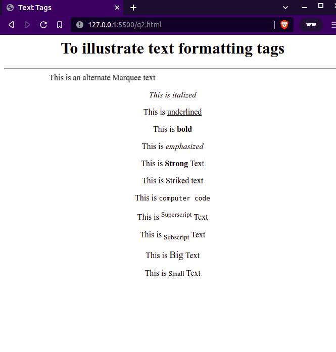
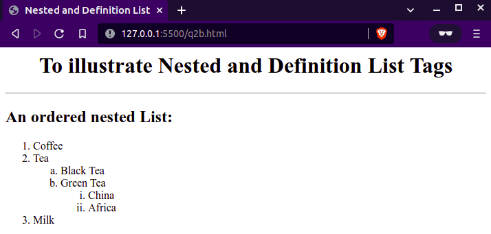
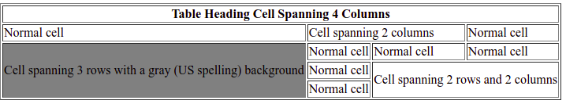
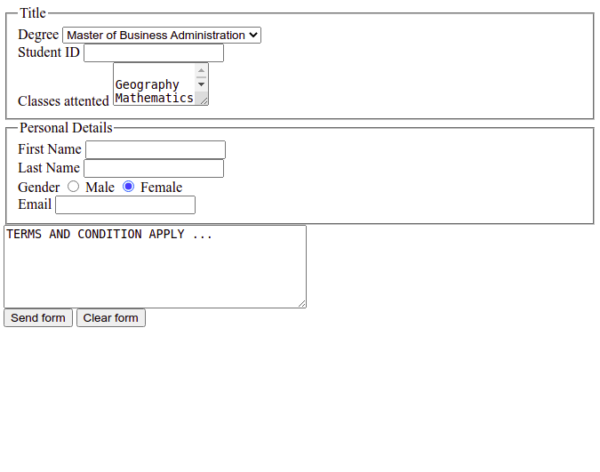

# Q1
```html
<html>
<head>
<title>Q1</title>
</head>
<body background="./assets/whtbrickwallbg.gif">
<!-- Ahmad Abdullah Web Technologies 09 April 2022-->
<h1>Q1</h1>
<code>
<pre>
public class Q1 {
    public static void main(String[] args) {
        System.out.println("Hello World!");
    }
}
</pre>
</code>
</body>
</html>
```


# Q2a
```html
<html>
  <head>
    <title>Text Tags</title>
  </head>
  <body>
    <!-- Ahmad Abdullah Web Technologies 09 April 2022-->
    <center>
      <h1>To illustrate text formatting tags</h1>
      <hr />
      <marquee>This is an alternate Marquee text</marquee>
      <p><i>This is italized</i></p>
      <p>This is <u>underlined</u></p>
        <p>This is <b>bold</b></p>
        <p>This is <em>emphasized</em></p>
        <p>This is <strong>Strong</strong> Text</p>
        <p>This is <strike>Striked</strike> text</p>
        <p>This is <code>computer code</code></p>
        <p>This is <sup>Superscript</sup> Text</p>
        <p>This is <sub>Subscript</sub> Text</p>
        <p>This is <big>Big</big> Text</p>
        <p>This is <small>Small</small> Text</p>
    </center>
  </body>
</html>
```



# Q2b
```html
<html>
  <head>
    <title>Nested and Definition List</title>
  </head>
  <body>
    <!-- Ahmad Abdullah Web Technologies 09 April 2022-->
    <center><h1>To illustrate Nested and Definition List Tags</h1></center>
    <hr/>
    <h2>An ordered nested List:</h2>
    <ol>
        <li>Coffee</li>
        <li>Tea
            <ol type="a">
                <li>Black Tea</li>
                <li>Green Tea
                    <ol type="i">
                        <li>China</li>
                        <li>Africa</li>
                    </ol>
                </li>
            </ol>
        </li>
        <li>Milk</li>
    </ol>
  </body>
</html>
```



# Q3

```html
<html>
  <head>
    <title>Question 3</title>
  </head>
  <body>
    <!-- Ahmad Abdullah Web Technologies 09 April 2022-->
    <table border="1">
      <tr>
        <th align="center" colspan="4">
          Table Heading Cell Spanning 4 Columns
        </th>
      </tr>
      <tr>
        <td>Normal cell</td>
        <td colspan="2">Cell spanning 2 columns</td>
        <td>Normal cell</td>
      </tr>
      <tr>
        <td rowspan="3" bgcolor="grey">Cell spanning 3 rows with a gray (US spelling) background</td>
        <td>Normal cell</td>
        <td>Normal cell</td>
        <td>Normal cell</td>
      </tr>
      <tr>
        <td>Normal cell</td>
        <td colspan="2" rowspan="2">Cell spanning 2 rows and 2 columns</td>
      </tr>
      <tr>
        <td>Normal cell</td>
      </tr>
    </table>
  </body>
</html>

```



# Q4

```html
<html>
  <head>
    <title>Question 4</title>
  </head>
  <body>
    <!-- Ahmad Abdullah Web Technologies 09 April 2022-->
    <form>
      <fieldset>
        <legend>Title</legend>
        <div>
          <label>Degree</label>
          <select>
            <option>Master of Business Administration</option>
            <option>Bachelor</option>
            <option>PhD</option>
          </select>
        </div>
        <div>
          <label>Student ID</label>
          <input type="text" />
        </div>
        <div>
          <label>Classes attented</label>
          <textarea name="textarea" rows="3" cols="11">
            Geography Mathematics English
          </textarea>
        </div>
      </fieldset>
      <fieldset>
        <legend>Personal Details</legend>
        <div>
          <label>First Name</label>
          <input type="text" />
        </div>
        <div>
          <label>Last Name</label>
          <input type="text" />
        </div>
        <div>
          <label>Gender</label>
          <input type="radio" /> Male
          <input type="radio" checked="true" /> Female
        </div>
        <div>
          <label>Email</label>
          <input type="email" />
        </div>
        <div>
      </fieldset>
      <textarea name="textarea" rows="6" cols="40">
TERMS AND CONDITION APPLY ...
      </textarea>
    </div>
    <div>
        <input type="submit" value="Send form">
        <input type="reset" value="Clear form">
        </div>
    </form>
  </body>
</html>
```

